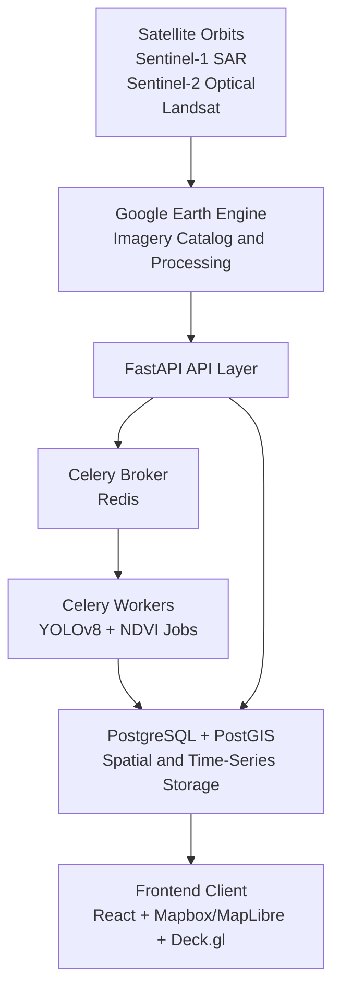

# Feen-Sentinel: A Planetary-scale Sentinel for Hedge Funds to Analyze "Ground" Macro-Economics 

Feen-Sentinel is our enterprise-grade, non-profit alternative data platform for global macro-economic monitoring where we utilize other sources of data. 

Using open imagery from ESA Sentinel and NASA Landsat through Google Earth Engine, we tracks indicators such as maritime trade volume (via SAR vessel detection) and agricultural productivity (via vegetation indices) to estimate regional and national economic health.

Our platform offers an alternative access to proprietary satellite analytics products, enabling researchers, students, and non-profits to explore historical trends, analyze asset-level performance, and run machine learning-assisted forecasts through an interactive geospatial interface.

## Architecture Overview

## Core Pipeline

1. Frontend ingestion and triggering:
User selects an asset boundary (for example, a port polygon or agricultural basin). The client submits geometry payloads to FastAPI.

2. Asynchronous processing:
FastAPI stores a pending request and dispatches a Celery task through Redis.

3. Geospatial processing:
Celery workers query Google Earth Engine image collections, apply cloud masking, compute NDVI, and extract SAR backscatter signals.

4. Machine learning and analytics inference:
- Vessels (SAR): YOLOv8 and threshold-based detection estimate ship counts.
- Agriculture (multispectral): NIR/Red band analytics produce vegetation health time series.

5. Spatial storage:
Metrics and geometry-linked records are indexed in PostgreSQL/PostGIS for fast spatial and temporal queries.

6. Presentation layer:
Frontend consumes structured JSON endpoints and renders heatmaps, overlays, and trend charts.

## Data Pool

Current monitoring coverage focuses on the following data sources and signals:

| Target | Core Dataset | Metric Gathered | Frequency |
| :--- | :--- | :--- | :--- |
| Farms / Crops | COPERNICUS/S2_SR_HARMONIZED | Mean NDVI (Vegetation Health) | Every 5 Days |
| Walmart Lots (LA & Vegas) | COPERNICUS/S1_GRD | Mean SAR Backscatter (Lot Fullness Index) | Every 6–12 Days |

## Upcoming Capabilities — Planetary Macro-Economic Sentinel

Shifting our perspective from local coordinates to systemic, cross-industry supply chains. Since we utilize open-source satellite data, our target objects are things that emit strong thermal energy, reflect radar waves, or alter massive sections of the Earth's surface. The following twelve advanced alternative-data layers are being integrated into the mapping architecture using pure open-source data pools.

### 1. Industrial Manufacturing Vitality — Atmospheric Emissions

**The Concept:** Traditional industrial manufacturing produces heavy combustion. Instead of counting boxes outside a factory, we track the chemical composition of the air directly above industrial clusters.

| Attribute | Detail |
| :--- | :--- |
| **Data Source** | Sentinel-5P (TROPOMI sensor) via Google Earth Engine (`COPERNICUS/S5P/OFFL/L3_NO2`) |
| **Indicators Tracked** | Column density of Nitrogen Dioxide (NO₂) and Sulfur Dioxide (SO₂) |
| **Analytics** | Subtract seasonal baselines and map monthly density anomalies over industrial zones (e.g., Germany's Ruhr Valley, China's Pearl River Delta, Ohio's manufacturing corridors) |
| **Forecast Power** | Real-time proxy for the Purchasing Managers' Index (PMI) and industrial production output — **3 to 5 weeks before government reports** are published |

---

### 2. Global Crude Oil Inventories — Floating-Roof Tank Volumetrics

**The Concept:** Massive crude oil storage tanks use floating roofs that sink when empty (casting a crescent shadow inside the rim) and sit flush when full (no internal shadow). By tracking these shadows from orbit, we estimate global oil inventories.

| Attribute | Detail |
| :--- | :--- |
| **Data Source** | Sentinel-2 Optical (10m resolution) and Sentinel-1 SAR (radar backscatter) |
| **Target Hubs** | Cushing (Oklahoma), Rotterdam, and other major crude oil storage clusters |
| **Analytics** | Track pixel width of internal crescent shadows over time; calculate ratio of shadow width to tank diameter to estimate crude oil volume |
| **Insight** | An open-source window into global energy supply gluts and deficits, updated with each satellite pass |

---

### 3. GDP Nowcasting & Grid Stability — Nighttime Lights

**The Concept:** There is a nearly 1:1 mathematical correlation between a region's artificial light emissions at night and its localized economic output.

| Attribute | Detail |
| :--- | :--- |
| **Data Source** | Suomi NPP / VIIRS Day-Night Band (DNB) via Google Earth Engine (`NOAA/VIIRS/DNB/MONTHLY_V1/VCMSLCFG`) |
| **Analytics** | Measure total sum of nighttime luminosity (radiance) across cities, states, or nations month-over-month |
| **Applications** | Build a highly accurate **GDP Nowcaster** — invaluable for data-scarce economies or closed regimes where official statistics are manipulated or delayed |
| **Grid Monitoring** | Sudden drops in luminosity over industrial zones pinpoint regional power grid failures, energy rationing, or factory shutdowns in real time |

---

### 4. Commodity Supply Chain Tracking — Open-Pit Mine Expansion

**The Concept:** Copper, iron ore, coal, and lithium are the bedrock of global infrastructure. By measuring structural changes in open-pit mines from space, we track the raw supply side of global commodities.

| Attribute | Detail |
| :--- | :--- |
| **Data Source** | Sentinel-1 SAR combined with Landsat 8/9 Short-Wave Infrared (SWIR) bands |
| **SWIR Analytics** | Identify specific mineral signatures and track the volume of tailing dams (waste pools) |
| **SAR Analytics** | Sentinel-1 radar detects surface roughness changes — when heavy machinery breaks new ground or expands pit borders, radar backscatter changes instantly due to soil disturbance |
| **Leading Indicator** | Physical expansion speed of mines generates a leading indicator for **global commodity supply availability** |

---

### 5. Heavy Metal Smelting & Blast Furnace Utilization

**The Concept:** Steel, aluminum, and copper smelters operate at temperatures exceeding 1,000°C (1,832°F). When a factory shuts down, slows production, or goes offline due to supply chain backlogs, its thermal footprint drops instantly.

| Attribute | Detail |
| :--- | :--- |
| **Data Source** | Sentinel-2 Surface Reflectance (`COPERNICUS/S2_SR_HARMONIZED`) — Short-Wave Infrared (SWIR) bands |
| **Band Math** | Normalized Hotspot Index (NHI): $$\text{NHI} = \frac{\text{B12} - \text{B11}}{\text{B12} + \text{B11}}$$ where B12 = SWIR 2 (2190nm), B11 = SWIR 1 (1610nm) |
| **Target Zones** | Polygon grids over Baosteel (China), ThyssenKrupp (Germany), Alcoa aluminum foundries |
| **Forecast Power** | Real-time global steel and aluminum production curves — **30 to 45 days before** the World Steel Association publishes official indices |

---

### 6. Commercial Aviation Capacity & Global Tourism Activity

**The Concept:** A Boeing 777 or Airbus A350 spans roughly 65–73 meters in length and wingspan — registering as a distinct 6×7 pixel cross-shape on Sentinel-2 optical imagery. Counting planes at tarmacs and desert storage yards reveals travel demand and recession signals.

| Attribute | Detail |
| :--- | :--- |
| **Data Source** | Sentinel-2 Optical (`COPERNICUS/S2_SR_HARMONIZED`) — True-color bands B4 (Red), B3 (Green), B2 (Blue) |
| **Analytics** | Specialized YOLOv8 object detection model counts aircraft at major transit hubs (Hartsfield-Jackson Atlanta, Dubai International) and long-term desert storage yards (Marana Aerospace in Arizona, Teruel Airport in Spain) |
| **Macro Signal** | A spike in aircraft parked at desert storage yards acts as a **leading indicator of macroeconomic recessions or travel sector collapses** |

---

### 7. Hydroelectric Power Generation Capacity

**The Concept:** Hydroelectric dams supply a massive percentage of regional power grids. Their energy generation potential is entirely dependent on the volume of water stored in their upstream reservoirs.

| Attribute | Detail |
| :--- | :--- |
| **Data Source** | Sentinel-2 or Landsat 8/9 Level 2 (`LANDSAT/LC08/C02/T1_L2`) |
| **Band Math** | Modified Normalized Difference Water Index (MNDWI): $$\text{MNDWI} = \frac{\text{Green} - \text{SWIR}}{\text{Green} + \text{SWIR}}$$ |
| **Analytics** | Water absorbs SWIR light (turning completely black), while surrounding soil reflects it. Dynamically calculate reservoir polygon boundaries over time to track water surface area and infer lake volume drop-offs |
| **Insight** | Direct view into impending **grid vulnerabilities, industrial power-rationing risks, and localized agricultural droughts** |

---

### 8. Oil & Gas Production Velocity — Shale Flaring Intensity

**The Concept:** Oil and gas extraction sites frequently burn off excess natural gas through industrial flaring. The size, intensity, and frequency of these flares are directly correlated to the extraction volume of shale oil fields.

| Attribute | Detail |
| :--- | :--- |
| **Data Source** | NOAA/VIIRS Day-Night Band Nighttime Lights or Landsat 8/9 Thermal Infrared Sensor (TIRS) Band 10 (`ST_B10` Surface Temperature) |
| **Target Basins** | Permian Basin (Texas), Bakken Formation (North Dakota), Ghawar field (Saudi Arabia) |
| **Analytics** | Schedule midnight queries over shale basins; filter out low-temperature background signatures to target extreme thermal anomalies |
| **Macro Signal** | Plotting the sum of radiant heat or nighttime light radiance from point-source flares enables **weekly tracking of crude oil extraction output** |

---

### 9. Urban Infrastructure Expansion & Real Estate Development

**The Concept:** Instead of relying on lagging housing start surveys, measure real estate development by tracking how radar waves bounce off concrete foundations, structural steel frameworks, and new asphalt roads.

| Attribute | Detail |
| :--- | :--- |
| **Data Source** | Sentinel-1 Synthetic Aperture Radar (SAR) (`COPERNICUS/S1_GRD`) |
| **Analytics** | SAR Backscatter Intensity Change Analysis — smooth soil and open fields reflect radar away (dark, low-return signal), while urban structures create a "double-bounce" effect (bright, high-intensity return) |
| **Macro Signal** | When developers lay concrete or build warehouses, pixel return transitions instantly from dark to bright — providing an **objective metric for global infrastructure construction velocity** |

---

### 10. Timber Supply Chains & Forestry Commodity Volume

**The Concept:** Global construction relies heavily on the lumber market. Tracking clear-cutting patterns across massive industrial timberlands gives a leading indicator for lumber commodity pricing.

| Attribute | Detail |
| :--- | :--- |
| **Data Source** | Sentinel-2 Multi-Spectral Imagery |
| **Band Math** | Normalized Burn Ratio (NBR) — highly responsive to removal of dense forest canopies: $$\text{NBR} = \frac{\text{NIR} - \text{SWIR}}{\text{NIR} + \text{SWIR}}$$ |
| **Analytics** | Intact forests exhibit high Near-Infrared (NIR) and low SWIR reflectance. When logged, the ratio flips. Track massive forest plots across the Pacific Northwest, Canada, and Brazil |
| **Trading Edge** | Compute **exact acreage of timber harvested month-over-month** — a distinct informational edge for lumber futures trading |

---

### 11. Sanctions Evasion & Illicit "Dark Vessel" Shipping

**The Concept:** Commercial ships are legally required to broadcast via AIS transponders, but vessels transporting sanctioned oil or illicit cargo often turn them off. Sentinel-1 SAR detects metal hulls regardless of transponder status.

| Attribute | Detail |
| :--- | :--- |
| **Data Source** | Sentinel-1 SAR (`COPERNICUS/S1_GRD`) cross-referenced against open-source public AIS telemetry feeds |
| **Analytics** | Extract ship detections from radar stream and cross-check coordinates against incoming AIS data |
| **Alert Trigger** | If radar identifies a 250-meter hull at coordinates where **no active AIS signal is reported**, the map drops an alert flag identifying a **dark vessel likely involved in ship-to-ship fuel transfers or sanctions-evasion transit** |

---

### 12. Floating-Roof Tank Cross-Validation — SAR Backscatter Phase Analysis

**The Concept:** Beyond optical shadow tracking (Capability #2), Sentinel-1 SAR's phase and backscatter signal can validate oil tank volumes through non-visual means — detecting the metallic roof's height position via radar interference patterns.

| Attribute | Detail |
| :--- | :--- |
| **Data Source** | Sentinel-1 SAR Interferometric Wide Swath (IW) mode |
| **Analytics** | Double-bounce scattering from the tank wall and floating roof creates a distinctive radar signature that varies with roof height. Cross-reference with optical volumetrics |
| **Operational Advantage** | Provides **all-weather, day/night tank monitoring capability** that works through cloud cover |

---

### Theme Switcher — Unified Macro Dashboard UI

To make these twelve layers feel like a cohesive experience, we are introducing a **Theme Switcher** on the frontend map interface:

| Theme | Layers Activated |
| :--- | :--- |
| 🌐 **Trade Theme** | Sentinel-1 vessel detection + Dark Vessel AIS cross-referencing |
| ⚡ **Energy Theme** | Oil Tank Volumetric pins + Floating-Roof SAR cross-validation + Shale Flaring Intensity |
| 🏭 **Industrial Theme** | Sentinel-5P NO₂/ SO₂ heat-map + Smelting NHI hotspot overlay |
| 📈 **Macro-Growth Theme** | Nighttime Lights GDP Nowcaster + Urban Infrastructure SAR expansion |
| 🌾 **Commodities Theme** | Open-Pit Mine Expansion + Timber NBR harvest tracking + Hydroelectric Reservoir drawdown |
| ✈️ **Travel & Logistics Theme** | Commercial Aviation YOLOv8 plane counts + Port congestion layer |

Each theme layers its own data sources, analytics engines, and chart panels — turning the map into a fully switchable planetary macro-economic intelligence dashboard.

## Technology Stack

| Layer | Component | Selected Technology | Operational Rationale |
| :--- | :--- | :--- | :--- |
| Frontend UI | Map engine | Mapbox GL / MapLibre GL | High-performance vector mapping with smooth zoom, pan, and spatial interaction. |
| Frontend UI | Overlay graphics | Deck.gl | WebGL-based rendering for large geospatial datasets. |
| Frontend UI | Application | React + TypeScript | Modular architecture and strong typing for long-term maintainability. |
| Backend API | Engine core | Python 3.11 + FastAPI | Async-first API framework with excellent Python geospatial ecosystem support. |
| Backend API | Task pipeline | Celery | Handles long-running geospatial and ML workloads outside request cycles. |
| Backend API | Message broker | Redis | High-throughput in-memory transport for asynchronous jobs. |
| Storage layer | Relational + GIS | PostgreSQL 15 + PostGIS | ACID storage with advanced spatial query support. |
| Geospatial engine | Image processing | Google Earth Engine | Petabyte-scale cloud processing of open remote sensing datasets. |
| Deployment | Virtualization | Docker + Docker Compose | Reproducible local and cloud environments for complex geospatial dependencies. |

## Repository Blueprint

~~~text
open-sentinel/
├── .github/
│   └── workflows/
│       └── python-test.yml
├── backend/
│   ├── app/
│   │   ├── api/
│   │   │   └── v1/
│   │   │       ├── analytics.py
│   │   │       └── locations.py
│   │   ├── core/
│   │   │   ├── config.py
│   │   │   └── database.py
│   │   ├── models/
│   │   │   ├── location.py
│   │   │   └── metric.py
│   │   ├── services/
│   │   │   ├── gee_service.py
│   │   │   └── ml_inference.py
│   │   ├── tasks/
│   │   │   └── worker.py
│   │   └── main.py
│   ├── Dockerfile
│   └── requirements.txt
├── frontend/
│   ├── public/
│   ├── src/
│   │   ├── components/
│   │   ├── hooks/
│   │   ├── map/
│   │   ├── services/
│   │   ├── App.tsx
│   │   └── main.tsx
│   ├── Dockerfile
│   ├── package.json
│   └── tsconfig.json
├── docker-compose.yml
├── .env.example
└── README.md
~~~

## Local Quickstart

### 1. Prerequisites

Install and configure the following:

- Docker Desktop
- Git
- Google Earth Engine service account credentials

Clone the repository:

~~~bash
git clone https://github.com/your-nonprofit-org/open-sentinel.git
cd open-sentinel
~~~

### 2. Environment Setup

Create a local environment file:

~~~bash
cp .env.example .env
~~~

Populate the variables:

~~~env
# Postgres
POSTGRES_USER=sentinel_admin
POSTGRES_PASSWORD=secure_development_pass
POSTGRES_DB=sentinel_gis
POSTGRES_HOST=db
POSTGRES_PORT=5432

# Redis
REDIS_URL=redis://redis:6379/0

# Maps
MAPBOX_ACCESS_TOKEN=pk.your_public_mapbox_token_here

# Google Earth Engine credentials (base64-encoded JSON)
GEE_SERVICE_ACCOUNT_CREDENTIALS=eyJhY2NvdW50X2tleSI6ICJleGFtcGxlX2Jhc2U2NF9zdHJpbmcifQ==
~~~

### 3. Run Locally

Build and run all services:

~~~bash
docker-compose up --build
~~~

Default local services:

- FastAPI: http://localhost:8000
- API docs: http://localhost:8000/docs
- Frontend app: http://localhost:3000
- PostgreSQL/PostGIS: localhost:5432

## 14-Week Project Roadmap

### Phase 1: Architecture and Data Validation (Weeks 1-3)

Objective:
Validate data quality from Google Earth Engine and establish baseline project tooling.

Deliverables:

- Initialize repository standards and linting.
- Configure GEE and mapping credentials.
- Prototype Sentinel-1 and Sentinel-2 retrieval workflows.
- Validate cloud-masking and sampling quality.

### Phase 2: Spatial Database and Processing Pipelines (Weeks 4-6)

Objective:
Design spatial schema and implement asynchronous extraction workflows.

Deliverables:

- Enable PostGIS and spatial indexing.
- Create core entities for assets and metrics.
- Build polygon-driven processing in gee_service.py.
- Integrate Celery workers for background extraction tasks.

Reference schema snippet:

~~~sql
CREATE TABLE locations (
	id SERIAL PRIMARY KEY,
	name VARCHAR(255) NOT NULL,
	category VARCHAR(50) NOT NULL,
	boundary GEOMETRY(Polygon, 4326) NOT NULL
);

CREATE INDEX idx_locations_boundary
	ON locations
	USING GIST(boundary);
~~~

### Phase 3: Analytics and ML Integration (Weeks 7-9)

Objective:
Implement NDVI trend extraction and SAR vessel counting pipelines.

Deliverables:

- Add threshold-based SAR bright-spot detection.
- Integrate lightweight YOLOv8 workflows for vessel identification.
- Normalize and interpolate incomplete time-series data.
- Benchmark against known manual counts.

### Phase 4: Frontend and Geospatial UX (Weeks 10-12)

Objective:
Ship an interactive geospatial dashboard for selection, analysis, and visualization.

Deliverables:

- Scaffold React + TypeScript geospatial interface.
- Add Deck.gl polygon drawing and interaction tooling.
- Build chart-driven analytics side panels.
- Add frontend caching to reduce redundant requests.

### Phase 5: MVP Optimization and Deployment (Weeks 13-14)

Objective:
Optimize runtime performance and deploy a production-ready MVP.

Deliverables:

- Optimize PostGIS queries and Redis caching.
- Use multi-stage container builds.
- Deploy with reverse proxy and TLS.
- Publish API and developer environment documentation.

## Contribution Guidelines

Feen-Sentinel is an open-source initiative focused on planetary observation, research, and non-profit macro-economic transparency.

1. Fork the repository and create a feature branch.
2. Commit changes with conventional commit messages.
3. Push the branch to your fork.
4. Open a pull request into the development branch.

## Audience Guides

### Academic and Research Audience

Feen-Sentinel supports reproducible geospatial-economic research with transparent methods and open datasets.

- Research utility: Build and test hypotheses on maritime throughput, agricultural health, and macro trend proxies using multi-source satellite data.
- Method transparency: NDVI extraction, SAR-based vessel estimation, and pipeline assumptions are fully inspectable and auditable.
- Reproducibility: Containerized workflows and explicit environment configuration improve repeatability across labs and student teams.
- Suggested usage: Use this platform as a base for capstone projects, policy papers, or method benchmarking against proprietary alternatives.

### Open-Source Contributors

The codebase uses a modular full-stack architecture for contributors across backend, frontend, ML, and DevOps.

- Clear boundaries: FastAPI endpoints, Celery tasks, and frontend map modules are intentionally separated to simplify parallel contribution.
- Contribution surface: Add new indicators, improve model quality, optimize geospatial queries, or improve UI analytics workflows.
- Development experience: Docker Compose provides a consistent local runtime for feature development and testing.
- Suggested first contributions: Add tests for analytics endpoints, improve task observability, or implement additional map overlays.

### Donor and Non-Profit Stakeholders

The project provides mission-aligned infrastructure for public-interest intelligence with transparent governance and lower operating barriers.

- Mission fit: Expands access to macro-economic observability for organizations without access to high-cost proprietary data platforms.
- Practical outcomes: Supports food security monitoring, logistics visibility, and economic resilience analysis in underserved regions.
- Cost efficiency: Leverages open satellite programs and open-source technologies to reduce total ownership costs.
- Funding impact: Investments can be directed into measurable outputs such as new indicators, region coverage expansion, and reliability improvements.

## Attribution and Data Licensing

- ESA Sentinel data is distributed under Copernicus open access terms.
- Google Earth Engine usage is subject to Google Earth Engine terms of service.
- PostgreSQL and PostGIS are distributed under their respective open-source licenses.

