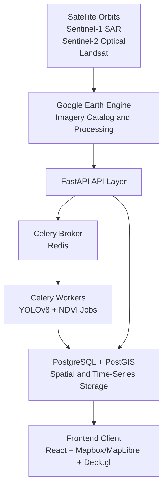

# Feen-Sentinel: Macro-Economic Geospatial Intelligence Platform

Feen-Sentinel is our enterprise-grade, non-profit alternative data platform for global macro-economic monitoring where we utilize other sources of data. 

Using open imagery from ESA Sentinel and NASA Landsat through Google Earth Engine, we tracks indicators such as maritime trade volume (via SAR vessel detection) and agricultural productivity (via vegetation indices) to estimate regional and national economic health.

Our platform offers an alternative access to proprietary satellite analytics products, enabling researchers, students, and non-profits to explore historical trends, analyze asset-level performance, and run machine learning-assisted forecasts through an interactive geospatial interface.

## Architecture Overview

## Core Pipeline

1. Frontend ingestion and triggering:
User selects an asset boundary (for example, a port polygon or agricultural basin). The client submits geometry payloads to FastAPI.

2. Asynchronous processing:
FastAPI stores a pending request and dispatches a Celery task through Redis.

3. Geospatial processing:
Celery workers query Google Earth Engine image collections, apply cloud masking, compute NDVI, and extract SAR backscatter signals.

4. Machine learning and analytics inference:
- Vessels (SAR): YOLOv8 and threshold-based detection estimate ship counts.
- Agriculture (multispectral): NIR/Red band analytics produce vegetation health time series.

5. Spatial storage:
Metrics and geometry-linked records are indexed in PostgreSQL/PostGIS for fast spatial and temporal queries.

6. Presentation layer:
Frontend consumes structured JSON endpoints and renders heatmaps, overlays, and trend charts.

## Technology Stack

| Layer | Component | Selected Technology | Operational Rationale |
| :--- | :--- | :--- | :--- |
| Frontend UI | Map engine | Mapbox GL / MapLibre GL | High-performance vector mapping with smooth zoom, pan, and spatial interaction. |
| Frontend UI | Overlay graphics | Deck.gl | WebGL-based rendering for large geospatial datasets. |
| Frontend UI | Application | React + TypeScript | Modular architecture and strong typing for long-term maintainability. |
| Backend API | Engine core | Python 3.11 + FastAPI | Async-first API framework with excellent Python geospatial ecosystem support. |
| Backend API | Task pipeline | Celery | Handles long-running geospatial and ML workloads outside request cycles. |
| Backend API | Message broker | Redis | High-throughput in-memory transport for asynchronous jobs. |
| Storage layer | Relational + GIS | PostgreSQL 15 + PostGIS | ACID storage with advanced spatial query support. |
| Geospatial engine | Image processing | Google Earth Engine | Petabyte-scale cloud processing of open remote sensing datasets. |
| Deployment | Virtualization | Docker + Docker Compose | Reproducible local and cloud environments for complex geospatial dependencies. |

## Repository Blueprint

~~~text
open-sentinel/
├── .github/
│   └── workflows/
│       └── python-test.yml
├── backend/
│   ├── app/
│   │   ├── api/
│   │   │   └── v1/
│   │   │       ├── analytics.py
│   │   │       └── locations.py
│   │   ├── core/
│   │   │   ├── config.py
│   │   │   └── database.py
│   │   ├── models/
│   │   │   ├── location.py
│   │   │   └── metric.py
│   │   ├── services/
│   │   │   ├── gee_service.py
│   │   │   └── ml_inference.py
│   │   ├── tasks/
│   │   │   └── worker.py
│   │   └── main.py
│   ├── Dockerfile
│   └── requirements.txt
├── frontend/
│   ├── public/
│   ├── src/
│   │   ├── components/
│   │   ├── hooks/
│   │   ├── map/
│   │   ├── services/
│   │   ├── App.tsx
│   │   └── main.tsx
│   ├── Dockerfile
│   ├── package.json
│   └── tsconfig.json
├── docker-compose.yml
├── .env.example
└── README.md
~~~

## Local Quickstart

### 1. Prerequisites

Install and configure the following:

- Docker Desktop
- Git
- Google Earth Engine service account credentials

Clone the repository:

~~~bash
git clone https://github.com/your-nonprofit-org/open-sentinel.git
cd open-sentinel
~~~

### 2. Environment Setup

Create a local environment file:

~~~bash
cp .env.example .env
~~~

Populate the variables:

~~~env
# Postgres
POSTGRES_USER=sentinel_admin
POSTGRES_PASSWORD=secure_development_pass
POSTGRES_DB=sentinel_gis
POSTGRES_HOST=db
POSTGRES_PORT=5432

# Redis
REDIS_URL=redis://redis:6379/0

# Maps
MAPBOX_ACCESS_TOKEN=pk.your_public_mapbox_token_here

# Google Earth Engine credentials (base64-encoded JSON)
GEE_SERVICE_ACCOUNT_CREDENTIALS=eyJhY2NvdW50X2tleSI6ICJleGFtcGxlX2Jhc2U2NF9zdHJpbmcifQ==
~~~

### 3. Run Locally

Build and run all services:

~~~bash
docker-compose up --build
~~~

Default local services:

- FastAPI: http://localhost:8000
- API docs: http://localhost:8000/docs
- Frontend app: http://localhost:3000
- PostgreSQL/PostGIS: localhost:5432

## 14-Week Project Roadmap

### Phase 1: Architecture and Data Validation (Weeks 1-3)

Objective:
Validate data quality from Google Earth Engine and establish baseline project tooling.

Deliverables:

- Initialize repository standards and linting.
- Configure GEE and mapping credentials.
- Prototype Sentinel-1 and Sentinel-2 retrieval workflows.
- Validate cloud-masking and sampling quality.

### Phase 2: Spatial Database and Processing Pipelines (Weeks 4-6)

Objective:
Design spatial schema and implement asynchronous extraction workflows.

Deliverables:

- Enable PostGIS and spatial indexing.
- Create core entities for assets and metrics.
- Build polygon-driven processing in gee_service.py.
- Integrate Celery workers for background extraction tasks.

Reference schema snippet:

~~~sql
CREATE TABLE locations (
	id SERIAL PRIMARY KEY,
	name VARCHAR(255) NOT NULL,
	category VARCHAR(50) NOT NULL,
	boundary GEOMETRY(Polygon, 4326) NOT NULL
);

CREATE INDEX idx_locations_boundary
	ON locations
	USING GIST(boundary);
~~~

### Phase 3: Analytics and ML Integration (Weeks 7-9)

Objective:
Implement NDVI trend extraction and SAR vessel counting pipelines.

Deliverables:

- Add threshold-based SAR bright-spot detection.
- Integrate lightweight YOLOv8 workflows for vessel identification.
- Normalize and interpolate incomplete time-series data.
- Benchmark against known manual counts.

### Phase 4: Frontend and Geospatial UX (Weeks 10-12)

Objective:
Ship an interactive geospatial dashboard for selection, analysis, and visualization.

Deliverables:

- Scaffold React + TypeScript geospatial interface.
- Add Deck.gl polygon drawing and interaction tooling.
- Build chart-driven analytics side panels.
- Add frontend caching to reduce redundant requests.

### Phase 5: MVP Optimization and Deployment (Weeks 13-14)

Objective:
Optimize runtime performance and deploy a production-ready MVP.

Deliverables:

- Optimize PostGIS queries and Redis caching.
- Use multi-stage container builds.
- Deploy with reverse proxy and TLS.
- Publish API and developer environment documentation.

## Contribution Guidelines

Feen-Sentinel is an open-source initiative focused on planetary observation, research, and non-profit macro-economic transparency.

1. Fork the repository and create a feature branch.
2. Commit changes with conventional commit messages.
3. Push the branch to your fork.
4. Open a pull request into the development branch.

## Audience Guides

### Academic and Research Audience

Feen-Sentinel supports reproducible geospatial-economic research with transparent methods and open datasets.

- Research utility: Build and test hypotheses on maritime throughput, agricultural health, and macro trend proxies using multi-source satellite data.
- Method transparency: NDVI extraction, SAR-based vessel estimation, and pipeline assumptions are fully inspectable and auditable.
- Reproducibility: Containerized workflows and explicit environment configuration improve repeatability across labs and student teams.
- Suggested usage: Use this platform as a base for capstone projects, policy papers, or method benchmarking against proprietary alternatives.

### Open-Source Contributors

The codebase uses a modular full-stack architecture for contributors across backend, frontend, ML, and DevOps.

- Clear boundaries: FastAPI endpoints, Celery tasks, and frontend map modules are intentionally separated to simplify parallel contribution.
- Contribution surface: Add new indicators, improve model quality, optimize geospatial queries, or improve UI analytics workflows.
- Development experience: Docker Compose provides a consistent local runtime for feature development and testing.
- Suggested first contributions: Add tests for analytics endpoints, improve task observability, or implement additional map overlays.

### Donor and Non-Profit Stakeholders

The project provides mission-aligned infrastructure for public-interest intelligence with transparent governance and lower operating barriers.

- Mission fit: Expands access to macro-economic observability for organizations without access to high-cost proprietary data platforms.
- Practical outcomes: Supports food security monitoring, logistics visibility, and economic resilience analysis in underserved regions.
- Cost efficiency: Leverages open satellite programs and open-source technologies to reduce total ownership costs.
- Funding impact: Investments can be directed into measurable outputs such as new indicators, region coverage expansion, and reliability improvements.

## Attribution and Data Licensing

- ESA Sentinel data is distributed under Copernicus open access terms.
- Google Earth Engine usage is subject to Google Earth Engine terms of service.
- PostgreSQL and PostGIS are distributed under their respective open-source licenses.

